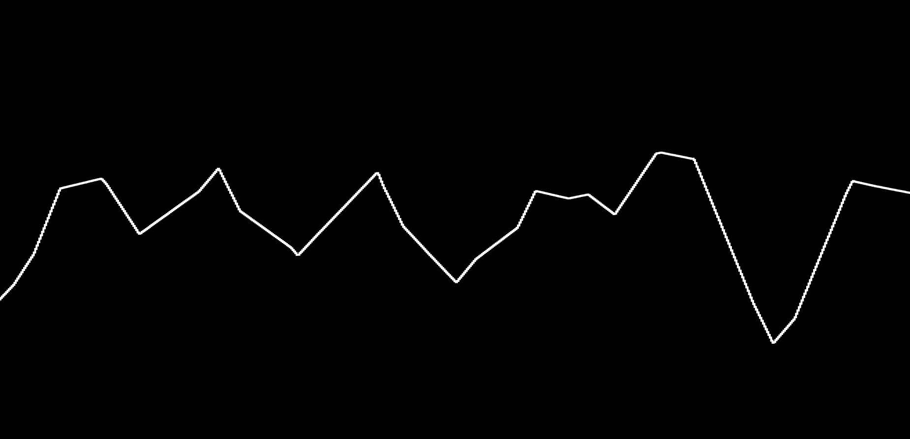

# FRACTRAN

A very WIP visualisation of [FRACTRAN](https://en.wikipedia.org/wiki/FRACTRAN) programs. Here, the current state of the program, which in a FRACTRAN program is just some number, is converted to a sound. [See a live demo here](https://projects.ollybritton.com/fractran).

The current demo calculates primes.
